# EARLY_EDA — what is in the data processed so far

Exploratory look at the samples that have gone through the full Logan sketch + FuncProfiler
profile in `/scratch/lbt5343/logan_full_run_25k/results` (plus the `logan_queue` runs that
published into it).

**Cohort (53,248 samples, 8,130 studies):** unitig DNA sketch, unitig protein sketch and a
KO profile with ≥ 1 KO all succeeded. 50,769 of these are also `qc_pass`. See
`tables/cohort_funnel.csv`.

| step | samples | studies |
|---|---|---|
| processed (≥ 1 published output) | 64,481 | 9,383 |
| unitig DNA sketch ok | 61,246 | 9,085 |
| + unitig protein sketch ok | 58,560 | 8,669 |
| + KO profile with ≥ 1 KO | **53,248** | **8,130** |

Metadata comes from the harmonized table built by `analysis/environment_discordance`
(BioSample + SRA + ENA, field rules in its `data_dictionary.md`). ID-like fields
(subject id, timepoint, lat/lon string, host taxid) are left out.

---

## 1. Metadata: what is present

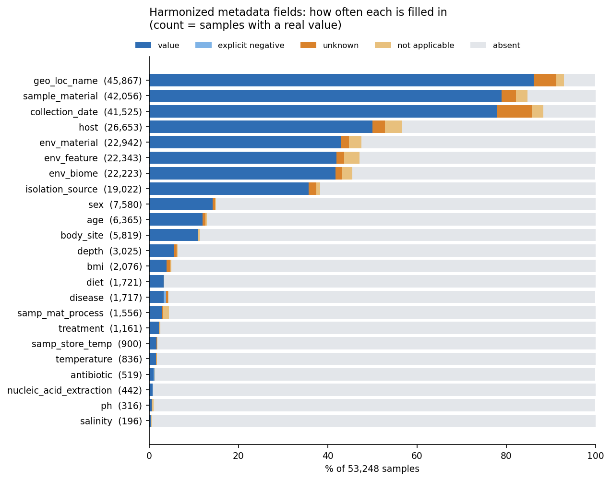

- **Almost always present:** country (86%), sample material (79%), collection date (78%).
- **About half:** host (50%), then the MIxS environment triplet env_biome / env_feature / env_material (~42%),
  and isolation_source (36%).
- **Rare:** sex 14%, age 12%, body site 11%, BMI 4%, diet 3%, **disease 3%** (+0.6% explicitly healthy),
  treatment 2%, antibiotics 1%, pH / temperature / salinity < 2%.
- The median sample has **5 of 23** harmonized fields filled (`meta_06`).
- Raw BioSample keys (`meta_02`, `tables/metadata_raw_attribute_keys.csv`): collection_date 88%, geo_loc_name 66%, host 50%;
  the same concept appears under many spellings (env_medium / environment_material / env_material …),
  which is why the harmonized fields above are the better guide.

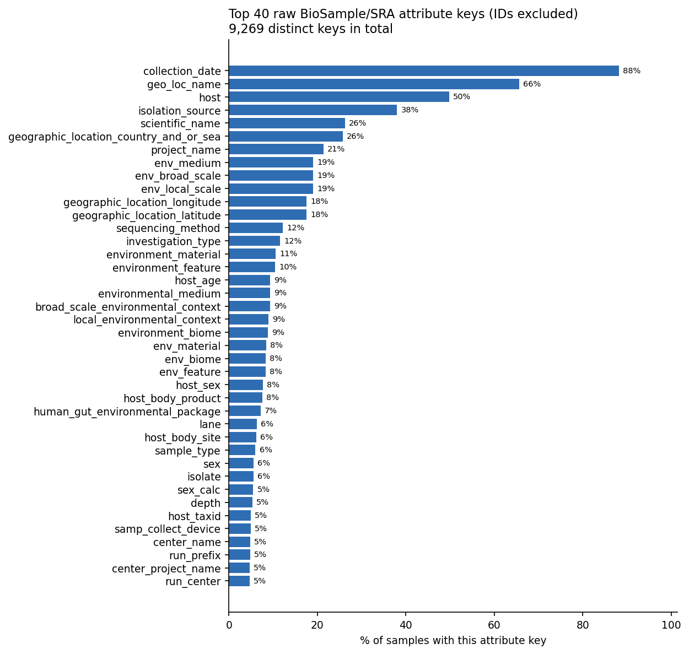

## 2. Metadata: values per field

**Environment** (`meta_03_values_environment`): human gut dominates (21,830 = 41%), then bare
"metagenome" (3,726), unspecified human site, soil, mouse gut, human respiratory / oral / skin,
marine, pig gut, wastewater. By body site: feces 20k, unspecified gut 8.6k, then oral, respiratory, skin.
env_biome is free text: top values "human gut", "urban biome", "anthropogenic terrestrial biome".

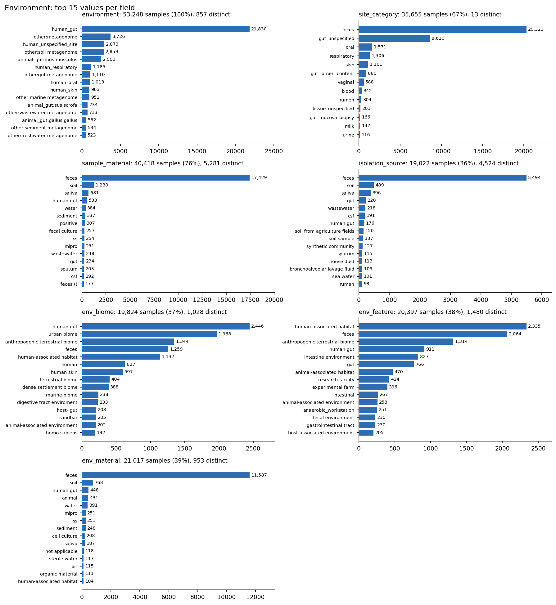

**Host and clinical** (`meta_03_values_host`): Homo sapiens 17.7k, mouse 2.0k, pig, chicken, cow, dog, horse.
Sex is balanced (3.9k F / 3.6k M).

**Disease** (`meta_04_disease`): 1,717 samples name a disease across 566 distinct strings, and 315 say
healthy/none. Most common: Crohn's disease (164, 12 studies), ulcerative colitis (94, 11 studies), NSCLC (43),
kidney failure, pathogen-challenge trials, colorectal cancer. Most disease labels come from a single study,
so disease is **not** usable as a cohort-wide label without per-study curation.

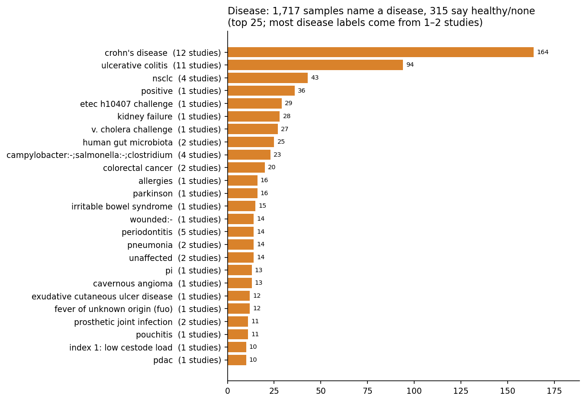

**Geography** (`meta_03_values_geography`): USA 30%, China 16%, UK 5%, then Denmark, Germany, France, Canada.
North America is 32% by continent. 33,580 samples have lat/lon (`meta_06` map).

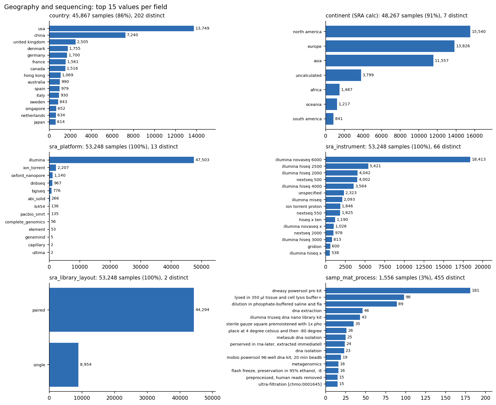

**Numbers** (`meta_05_numeric`): age median 30 y with a large infant spike at 0–1 y; BMI median 24.9;
collection years 2010–2025, peaking 2021; SRA release dates are strongly recent (2023–2025).
Sequencing is 89% Illumina (NovaSeq 6000 most common).

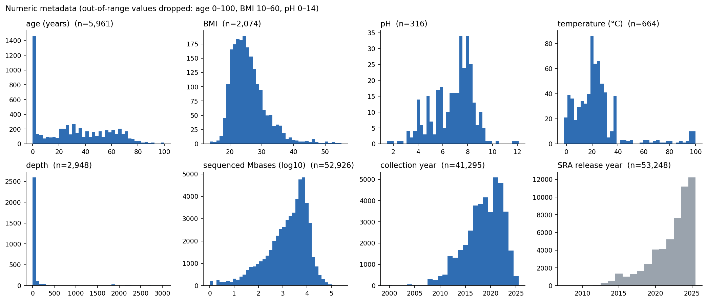
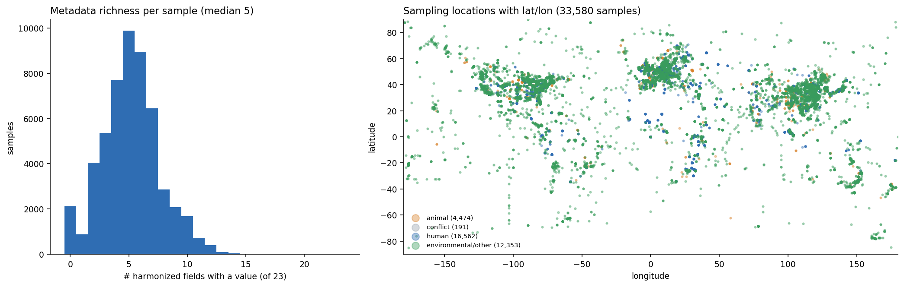

`tables/metadata_by_environment.csv` gives, for each environment, the % with country / disease / age / env_biome.
For example, disease is recorded for 11% of human-oral samples, 5% of human-gut samples and 0% of soil samples.

---

## 3. Sketches: which k-mers are seen the most

Every sketch is downsampled to scaled = 20,000 (a uniform 1/20 subset of hash space, so
prevalence stays unbiased). Then each hash is counted by how many samples contain it.
The top 5,000 are annotated: protein hashes against the FuncProfiler KO sketches, and DNA hashes
against the YACHT GTDB r232 reference sketches.

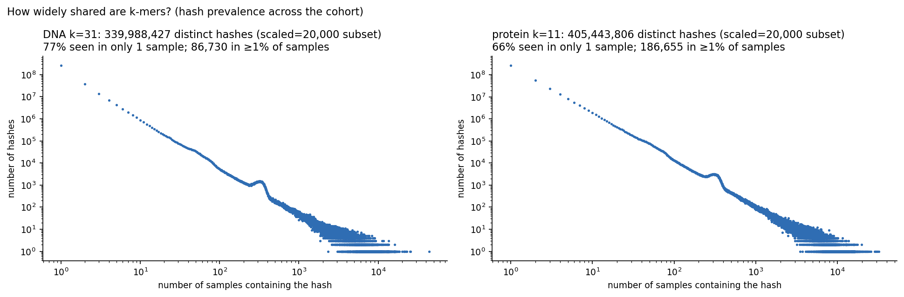

- **Most k-mers are private.** 77% of DNA and 66% of protein hashes occur in exactly one sample.
  Only 86,730 DNA / 186,655 protein hashes (in the subset) are in ≥ 1% of samples.
- **A bump at about 300 samples** appears in both curves: a block of hashes shared by the same few hundred samples,
  probably one large study or near-duplicate libraries. This is worth tracing (see follow-ups).
- **Top DNA hash (82% of samples)** occurs in 12,746 GTDB genomes across many phyla, so it is likely a conserved
  rRNA/tRNA k-mer. Most other top DNA hashes are gut-specific: Prevotella, Blautia_A, Faecalibacterium,
  Bacteroides, Phocaeicola (present in 30–48% of samples, mostly human/pig gut). A Streptomyces group is spread across soil, oral and marine.
  96% of the top 5,000 DNA hashes are in at least one GTDB representative genome.
- **Top protein hashes** fall in core housekeeping KOs (asnS/NARS, fabB/F, dnaK, pckA, RP-L20, gyrB, dnaE).
  Only 11% of the top 5,000 protein hashes are in a KO sketch. That is expected: the KO database is a
  scaled = 1000 subset of KEGG reference proteins, so most shared peptides are not in it.

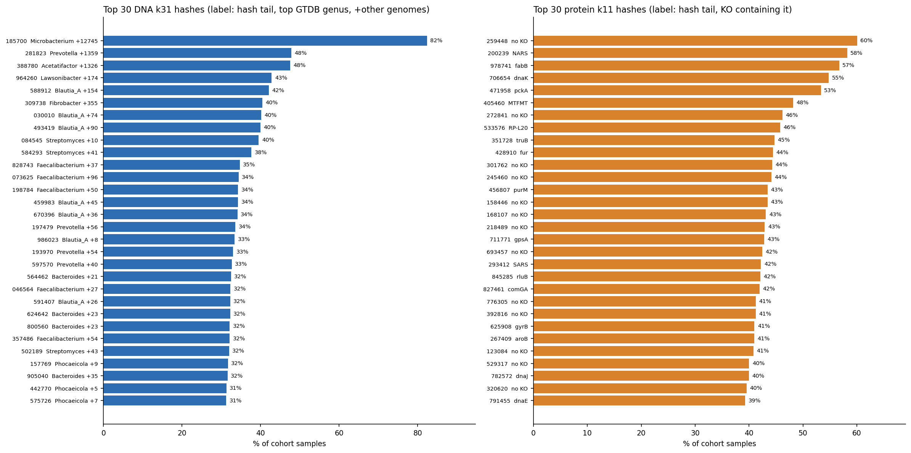
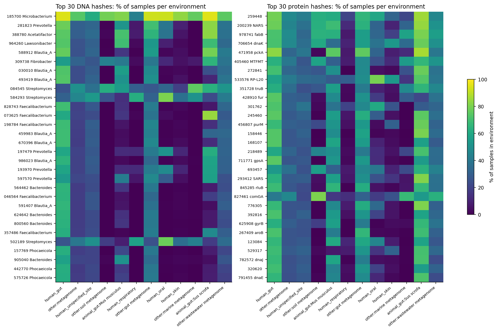

---

## 4. Functional profiles (KOs)

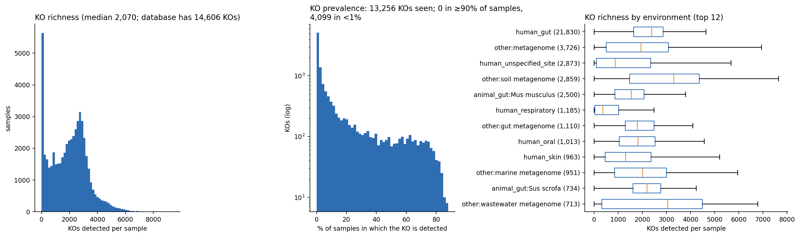

- **13,256 of 14,606** KOs in the FuncProfiler database are detected somewhere.
  The median sample has **2,070 KOs** (IQR 898–2,852).
- **About 5k samples have < 100 KOs** (the spike at 0). Their assemblies are tiny: the median unitig
  DNA sketch has about 1,000 hashes (roughly 1 Mbp of distinct 31-mers). They are concentrated in unspecified human sites,
  respiratory, blood and soil, so this is likely host-dominated or low-biomass material.
  Because of this group, no KO reaches 90% prevalence; the top KO is present in 88% of samples.
- Soil and wastewater have the richest profiles (median about 3,000+), and human respiratory the poorest.
- **Most prevalent KOs** are universal housekeeping genes: uvrA, glnA, valS, gyrA, tuf, rpoB/C, secA.
  **Highest mean abundance:** SusD/SusC (Bacteroidetes polysaccharide uptake), ABC transporters, lacZ, bglX,
  which reflects the gut-heavy cohort.

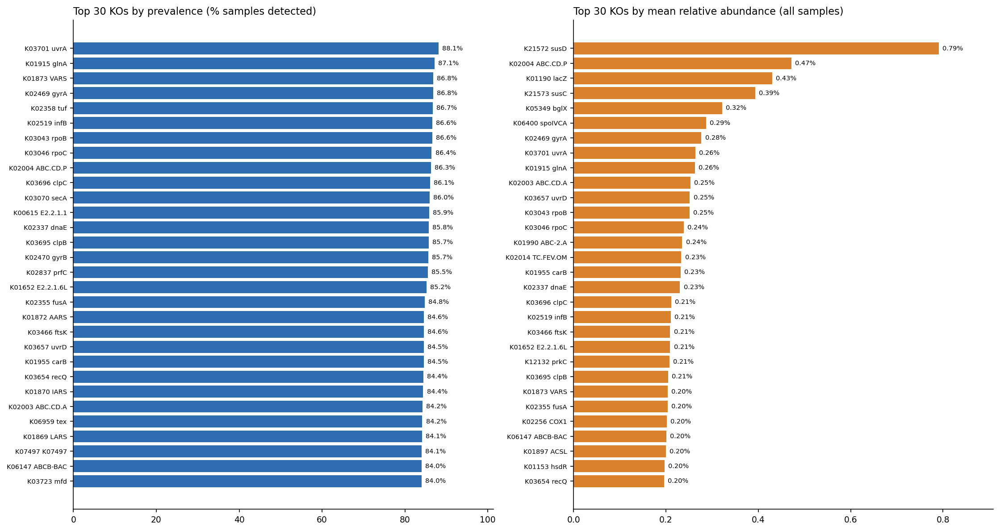

- **KEGG BRITE categories by environment** (`ko_03`): soil, marine and wastewater are enriched for energy metabolism,
  amino-acid metabolism and prokaryotic cellular community (biofilm and quorum-sensing KOs). Human gut is higher in carbohydrate metabolism
  and glycan biosynthesis. Oral and pig gut are low in signal transduction.
- **KOs that separate environments** (`ko_04`): sporulation (spo0A, spoVAD) and hydrogenase genes mark gut samples;
  CO-dehydrogenase (coxL/S/M) and methylcrotonyl-CoA carboxylase (MCCC1/2) mark soil and marine samples;
  tetM is in about 95% of pig-gut samples.

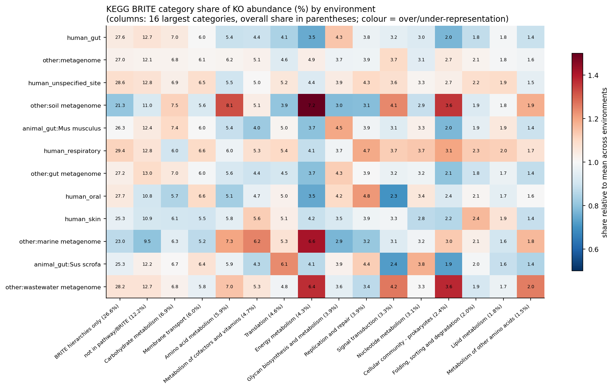
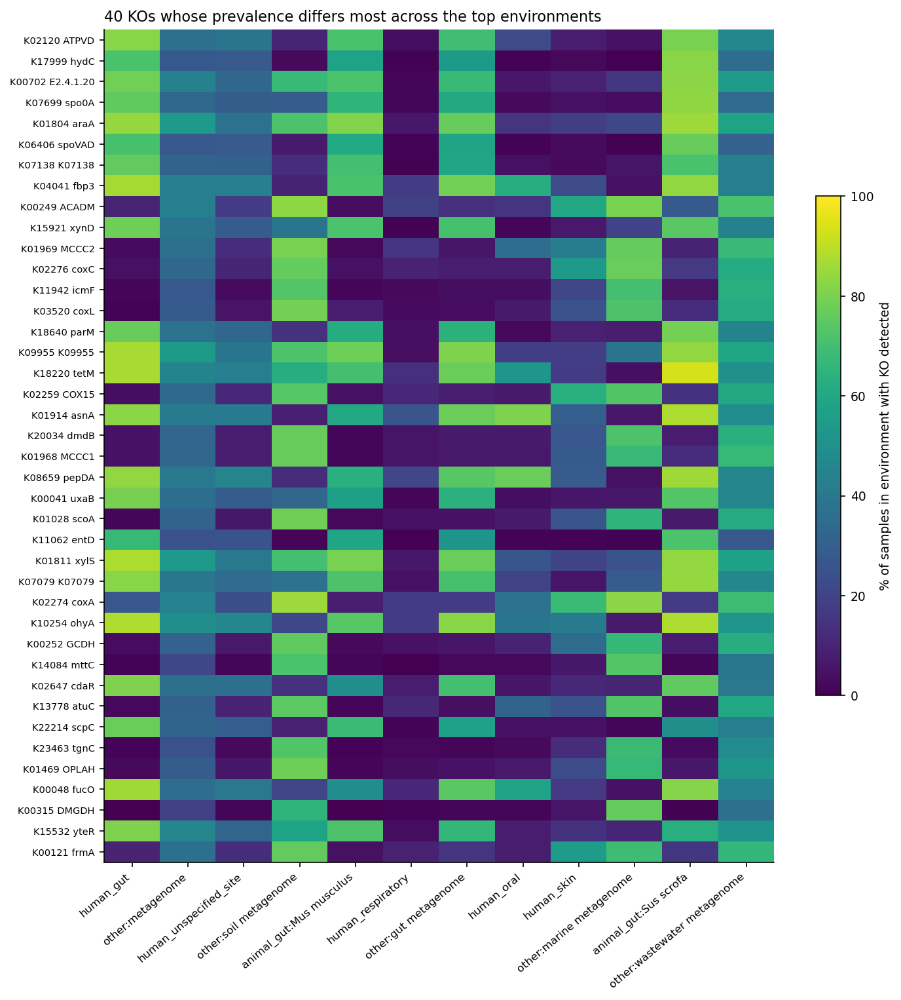

---

## 5. Taxonomy (YACHT)

YACHT profiles come from the lab's shared Logan YACHT database, not from this pipeline, and cover
**only about half the cohort** (26,326 samples at min_coverage 1/16). Coverage by environment is in
`tables/taxa_profile_coverage_by_environment.csv`. YACHT makes a presence call per GTDB r232 representative genome.
Lineages use GTDB r232 names, and 3% of the detected genomes (not r232 representatives) fall back to their NCBI taxid lineage.

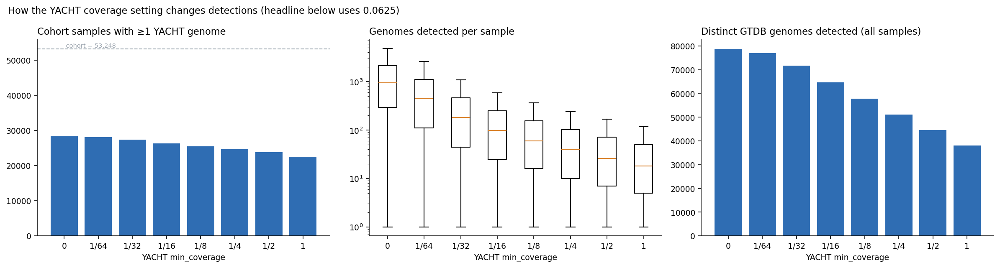

- **The min_coverage setting matters a lot for counts.** It barely changes which samples have a profile
  (53% of the cohort → 42%), but the median number of genomes per sample drops from 951 at 0 to 98 at 1/16 and 18 at 1.
  All the rankings below use 1/16, matching the multiview pipeline.
- **Phyla:** Pseudomonadota 87% of samples, Bacillota 83%, Bacteroidota 78%, Actinomycetota 78%.
  **Genera:** Bacteroides 52%, Phocaeicola 48%, Parabacteroides, Roseburia, Veillonella, Streptococcus,
  Faecalibacterium, Blautia_A, Bifidobacterium (about 43% each). **Species:** Phocaeicola dorei 44%, then Veillonella
  sp900757715, Bacteroides rodentium, Blautia_A wexlerae, Parabacteroides distasonis, E. coli.

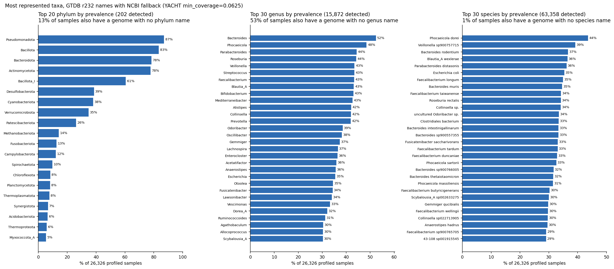

- **Phylum make-up** (`tax_03`) separates environments cleanly: gut is Bacillota-dominated, soil is Actinomycetota +
  Pseudomonadota, marine is mostly Pseudomonadota, and skin is mostly Actinomycetota (Cutibacterium, Staphylococcus in `tax_04`).
  The oral and respiratory signature is Neisseria / Porphyromonas / Haemophilus_D / Rothia.

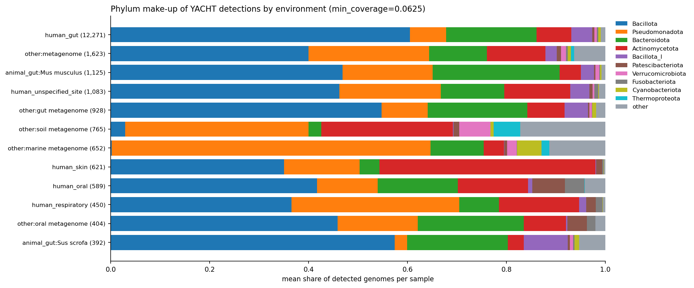
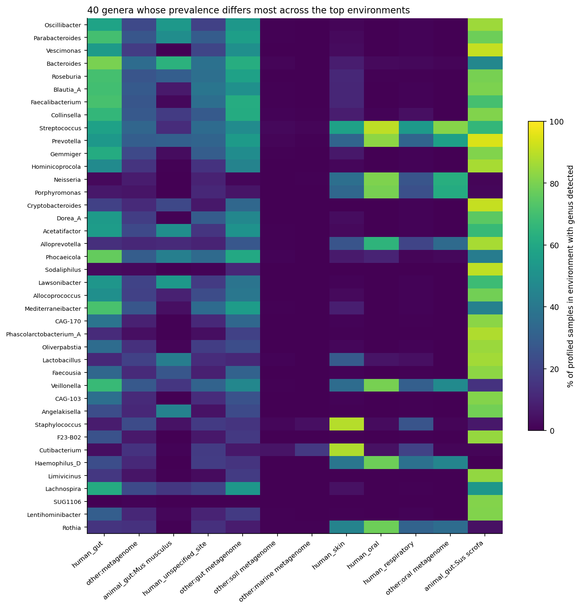

---

## Caveats

- `environment` is derived from host + body-site / material, falling back to the SRA `organism` label.
  "other:metagenome" (3.7k) means no usable label.
- The cohort is **41% human gut**. Anything "most prevalent" overall is mostly a statement about gut.
- Samples are not independent: 8,130 studies, and a few studies contribute hundreds of samples.
  `metadata_by_environment.csv` and several tables report study counts alongside sample counts.
- KO `abundance` is FuncProfiler's containment share, not gene abundance. YACHT is presence, not abundance.
- Value cleanup is light (lower-casing, ENVO/UBERON id stripping, a small synonym list in `03_metadata.py`).
  Most free-text fields still have hundreds to thousands of distinct values.

## Suggested follow-ups

1. Trace the bump at about 300 samples in the hash-prevalence curves: which samples and studies share those hashes.
2. Build a human reference sketch to test whether the < 100-KO samples are host-dominated.
3. Extend YACHT to the other half of the cohort, or run it inside this pipeline.
4. Curate disease labels per study (IBD is the only disease with more than 10 studies).

---

## Layout and how to re-run

```
EARLY_EDA/
  cohort.parquet          the 53,248-sample cohort (all harmonized metadata columns)
  figures/*.png           meta_*, hash_*, ko_*, tax_*
  tables/*.csv            every number behind the figures (plus full, untruncated rankings)
  reference/              KEGG ko list + BRITE ko00001 (rest.kegg.jp, downloaded 2026-09-28)
  logs/                   logs of the long steps
  scripts/
    01_cohort.py          cohort definition + funnel
    02_hash_counts.py     downsample sketches, count hash prevalence (≈ 25 min, 32 procs, tens of GB RAM)
    03_metadata.py        metadata completeness and values
    04_ko.py              KO prevalence, richness, BRITE, per-environment
    05_taxonomy.py        YACHT coverage settings, top taxa, per-environment
    06_hash_annotate.py   annotate top hashes (KO, GTDB), per-environment (≈ 10 min)
```

```bash
conda activate logan
cd EARLY_EDA/scripts
python 01_cohort.py && python 02_hash_counts.py && python 03_metadata.py \
  && python 04_ko.py && python 05_taxonomy.py && python 06_hash_annotate.py
```

The downsampled per-sample hash cache is in `/scratch/lbt5343/early_eda_cache/{dna,prot}/` (can be deleted;
`02_hash_counts.py` rebuilds it).
