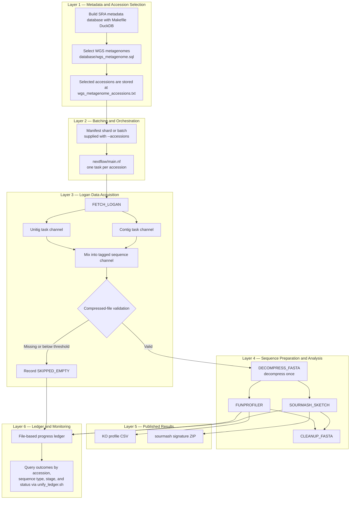

# Logan Sketch / FuncProfile Pipeline Design

## 1. Purpose

This pipeline selects whole-genome shotgun (WGS) metagenomic accessions from the Sequence Read Archive (SRA), retrieves the corresponding Logan unitig and contig assemblies, and analyzes each assembly with sourmash and FuncProfiler.

The design follows this workflow:

1. acquire SRA metadata and build a local DuckDB database;
2. select WGS metagenomic accessions;
3. retrieve unitigs and contigs from Logan;
4. skip missing or effectively empty sequence files;
5. run sequence sketching and functional profiling independently; and
6. publish analysis outputs and execution records.

The Logan v1.2 release is treated as a fixed dataset with an SRA cutoff date of **2025-12-31**. This date describes the release contents; it is not an S3 object modification-time filter.

## 2. Architecture

### 2.1 Data flow



The batching layer supplies a bounded accession manifest to Nextflow. Within that batch, `FETCH_LOGAN` runs once per accession and emits separate unitig and contig channels. `main.nf` mixes those channels into a single tagged stream so both sequence types follow the same validation and analysis layers while retaining their `seq_type` identity.

### 2.2 Stage summary

| Stage | Entry point | Responsibility | Primary output |
|---|---|---|---|
| 0 | `make create-db` | Synchronize SRA metadata and build DuckDB tables | `sra_metadata.db` |
| 1 | `make get-accessions` | Run the version-controlled WGS metagenome query | `wgs_metagenome_accessions.txt` |
| 2 | `nextflow/main.nf` | Convert accessions into independent work items | Accession channel |
| 3 | `FETCH_LOGAN` | Retrieve unitigs and contigs and apply the compressed-size gate | Tagged `.fa.zst` inputs or skip records |
| 4a | `DECOMPRESS_FASTA` | Decompress each validated assembly once | Shared FASTA input |
| 4b | `SOURMASH_SKETCH` | Generate FracMinHash sketches | `.sig.zip` files |
| 4c | `FUNPROFILER` | Identify KEGG Orthology groups and relative abundances | KO profile and prefetch CSV files |
| 4d | `CLEANUP_FASTA` | Delete the shared FASTA once both consumers are done with it | Freed scratch space |
| 5 | Ledger and publication processes | Record stage outcomes and publish durable results | CSV ledger rows and result files |

## 3. Nextflow Structure

### 3.1 `nextflow/main.nf`: top-level orchestration

`nextflow/main.nf` defines the overall Nextflow data flow.

1. It reads `params.accessions`, which defaults to `wgs_metagenome_accessions.txt`.
2. It trims each line and removes blank lines and comments.
3. It sends each accession to `FETCH_LOGAN` as an independent task.
4. It combines fetched unitig and contig outputs into tuples shaped as `(accession, seq_type, zst_path, status)`.
5. It branches those tuples by fetch status.
6. It records `SKIPPED_EMPTY` inputs through `WRITE_LEDGER_ROW`.
7. It removes the status field from valid tuples and sends `(accession, seq_type, zst_path)` to `ANALYZE`.

### 3.2 `nextflow/nextflow.config`: parameters and execution policy

`nextflow/nextflow.config` contains settings that vary between environments or runs:

- default paths for the accession manifest, KO signatures, and result directory;
- empty-file, sourmash, and FuncProfiler parameters;
- the local executor and default CPU and memory requests;
- process-specific resource overrides;
- S3 download throttling and retry limits;
- the `standard`, `test`, and `benchmark` profiles; and
- Nextflow trace and HTML report configuration.

### 3.3 `nextflow/modules/fetch.nf`: Logan retrieval and input gate

`FETCH_LOGAN` runs once per accession. It retrieves both public Logan objects:

```text
s3://logan-pub/u/<accession>/<accession>.unitigs.fa.zst
s3://logan-pub/c/<accession>/<accession>.contigs.fa.zst
```

Logan does not always publish both files for an accession. A key that does not exist is a permanent 404, not the transient S3 error the process's `errorStrategy` retries, so it is treated as an empty download and caught by the compressed-size gate. Any file smaller than `params.min_compressed_bytes` is marked `SKIPPED_EMPTY` before `zstd -d` is ever called, because zstd hangs on such files.

### 3.4 `nextflow/subworkflows/analyze.nf`: analysis composition

`ANALYZE` accepts tuples shaped as `(accession, seq_type, zst_fasta)`. It first decompresses each input and then fans the shared FASTA out to sourmash and FuncProfiler:

```text
compressed input ─> DECOMPRESS_FASTA ─┬─> SOURMASH_SKETCH ─> sketches
                                      └─> FUNPROFILER ─────> KO profiles
```

`FUNPROFILER` only runs on the sequence types in `params.funprofiler_seq_types` (both by default: contig KOs are not a subset of unitig KOs). `CLEANUP_FASTA` deletes each decompressed FASTA — often multi-GB — as soon as both consumers have finished with it, rather than waiting for end-of-run cleanup.

### 3.5 Outputs

Outputs are stored at:

```bash
results/
  ├── ko_profiles/
  ├── sketches/
  ├── ledger/
  ├── pipeline_trace.tsv
  └── pipeline_report.html
```

## 4. Progress, Failure Handling, and Resume

Expected ledger statuses are:

| Status | Meaning |
|---|---|
| `DONE` | The stage completed and produced its expected result |
| `SKIPPED_EMPTY` | The Logan object was missing or below the compressed-size threshold |

Nextflow's work cache is the primary resume mechanism. A run uses `-resume` with the same launch directory and declared inputs. The ledger is a durable audit trail, but the current CSV implementation does not schedule or suppress tasks. Scheduling from ledger state is a future orchestration feature.

## 5. Ledger

Each task writes its own single-row CSV into `results/ledger/` (`nextflow/bin/write_ledger_row.sh`) instead of all tasks writing into one shared DuckDB file, because many tasks run concurrently and DuckDB does not support concurrent writers to a single file. `nextflow/unify_ledger.sh` unions those files into one queryable DuckDB table after (or during) a run; `nextflow/query_ledger.sh` is an example query over them.

## 6. Execution and Validation

After installing the environment and preparing the manifest, a standard run is:

```bash
nextflow run nextflow -resume
```

A bounded run uses a separate manifest:

```bash
nextflow run nextflow --accessions path/to/accession_shard.txt -resume
```

`nextflow/test/run_unit_test.sh` runs the full pipeline on one accession (`DRR001355`) and compares every published output against the known-good results in `DRR001355_test_res/`. It exits nonzero on any mismatch, so it can gate a benchmark or production run.
